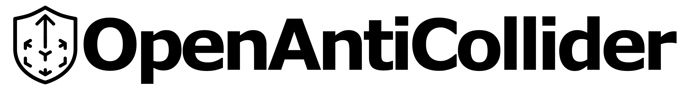

  

# OpenAntiCollider

An Open Source Project for VRChat that provides robust detection against avatar collider abuse and movement exploits using UdonSharp.

---

## English

### 1. Overview
OpenAntiCollider detects various cheating behaviors such as speed hacks, fly hacks, and flying or floating using colliders. When detected, the system accumulates a penalty score, and once the threshold is exceeded, the player can be forcibly teleported or penalized to protect the fairness of your world.

**Sample World:** [VRChat](https://vrchat.com/home/world/wrld_3f5533d6-e262-4e24-a2b7-b5dbf5660751/info)

### 2. Installation
1. UdonSharp is required.
2. Import the Unitypackage.
3. Place `OpenAntiColliderObject` in the hierarchy.
4. Adjust the parameters in the Inspector of `OpenAntiColliderObject` as needed.

### 3. Features & Variables

#### General Settings
| Variable | Description |
| :--- | :--- |
| **penaltyThreshold** | The score threshold that triggers penalty actions. |
| **scoreDecayRate** | How fast the penalty score decreases per second when no anomalies are detected. |

#### Speed Hack Detection
| Variable | Description |
| :--- | :--- |
| **enableSpeedHackDetection** | Enable/disable speed hack detection. |
| **speedHackWeight** | Penalty score added per second when speed hack is detected. |
| **maxWalkSpeed** | Maximum allowed horizontal speed (m/s). Exceeding this triggers detection. |

#### Fly Hack Detection
| Variable | Description |
| :--- | :--- |
| **enableFlyHackDetection** | Enable/disable fly hack detection. |
| **flyHackWeight** | Penalty score added per second when fly hack is detected. |
| **fallVelocityThreshold** | Minimum downward velocity expected when airborne. Values above this while not grounded trigger detection. |

#### Fake Ground Detection
| Variable | Description |
| :--- | :--- |
| **enableFakeGroundDetection** | Enable/disable fake ground (invisible collider) detection. |
| **fakeGroundWeight** | Penalty score added per second when fake ground is detected. |
| **groundCheckInterval** | Interval (seconds) between ground validation checks. |
| **sphereCastRadius** | Radius of the sphere used for ground detection. |
| **sphereCastOriginHeight** | Height offset from player position for the sphere cast origin. |
| **sphereCastMaxDistance** | Maximum distance of the sphere cast downward. |
| **groundLayers** | LayerMask defining which layers are considered valid ground. |

#### Collider Spam Detection (Layer 10)
| Variable | Description |
| :--- | :--- |
| **enableColliderSpamDetection** | Enable/disable collider spam detection. **Disabled by default** due to potential false positives. |
| **colliderSpamWeight** | Penalty score added per second when excessive colliders are detected. |
| **scanRadius** | Radius around the player to scan for colliders. |
| **playerLocalLayer** | The layer number to scan (default: 10 = PlayerLocal). |
| **colliderCheckInterval** | Interval (seconds) between collider scans. |

#### Penalty Actions
| Variable | Description |
| :--- | :--- |
| **teleportTarget** | Transform to teleport the player to when penalty is triggered. |
| **objectsToActivate** | Array of GameObjects to activate upon detection (e.g., isolation barriers). |
| **hideObjectsOnSafe** | If checked, deactivates the objects when the player is no longer detected. |
| **customScript** | An UdonSharp script to send a custom event to upon detection. |
| **customEventName** | The name of the custom event to send. |

#### Whitelist
| Variable | Description |
| :--- | :--- |
| **whiteList** | Array of display names excluded from detection. |

### 4. Notes
* **Collider Spam Detection** scans for colliders on the **PlayerLocal (Layer 10)**. If your world uses this layer for legitimate purposes, false positives may occur. This feature is disabled by default.
* This system uses a **score-based approach**: anomalies accumulate points over time, and penalties are only applied when the threshold is exceeded. This reduces false positives from brief lag spikes or legitimate gameplay.
* The author assumes no responsibility for any issues arising from the use of this script.

### 5. Tips
* The default values are tuned to avoid false positives during standard VRChat movements such as walking and jumping. Adjust the thresholds according to your world's needs.
* In worlds that inherently feature double jumps or high-speed dashes, complete anti-cheat based on movement speed alone is not possible. In such cases, consider enabling Layer 10 detection or other methods.

### 6. About Credit
While in-world credit is appreciated, it may also provide hints to malicious users on how to bypass the system. Therefore, we fully support world developers who choose not to display credit out of such concerns. 

---

## 日本語 (JP)

### 1. 概要
OpenAntiColliderは、スピードハック、フライハック、コライダーを使った飛行や空中浮遊など、様々なチート行為を検知します。検知時にはペナルティスコアが蓄積され、閾値を超えるとプレイヤーを強制テレポートさせたりペナルティを与えることで、ワールドの公平性を保護します。

**サンプルワールド:** [VRChat](https://vrchat.com/home/world/wrld_3f5533d6-e262-4e24-a2b7-b5dbf5660751/info)

### 2. 導入方法
1. UdonSharpが必要です。
2. Unitypackageをインポートします。
3. 'OpenAntiColliderObject'をヒエラルキー内に配置します。
4. 必要に応じて'OpenAntiColliderObject'のInspectorでパラメーターを調整してください。

### 3. 機能および変数の説明

#### 基本設定
| 変数名 | 説明 |
| :--- | :--- |
| **penaltyThreshold** | ペナルティが発動するスコアの閾値です。 |
| **scoreDecayRate** | 異常が検知されていない時に、スコアが毎秒減少する速度です。 |

#### スピードハック検知
| 変数名 | 説明 |
| :--- | :--- |
| **enableSpeedHackDetection** | スピードハック検知の有効/無効を切り替えます。 |
| **speedHackWeight** | スピードハック検知時に毎秒加算されるペナルティスコアです。 |
| **maxWalkSpeed** | 許容される最大水平速度（m/s）。これを超えると検知されます。 |

#### フライハック検知
| 変数名 | 説明 |
| :--- | :--- |
| **enableFlyHackDetection** | フライハック検知の有効/無効を切り替えます。 |
| **flyHackWeight** | フライハック検知時に毎秒加算されるペナルティスコアです。 |
| **fallVelocityThreshold** | 空中にいる時に期待される最小の下降速度。接地していない状態でこの値より上の速度だと検知されます。 |

#### フェイクグラウンド検知
| 変数名 | 説明 |
| :--- | :--- |
| **enableFakeGroundDetection** | フェイクグラウンド検知の有効/無効を切り替えます。 |
| **fakeGroundWeight** | フェイクグラウンド検知時に毎秒加算されるペナルティスコアです。 |
| **groundCheckInterval** | 地面検証チェックの間隔（秒）です。 |
| **sphereCastRadius** | 地面検知に使用するスフィアの半径です。 |
| **sphereCastOriginHeight** | プレイヤー位置からのスフィアキャスト原点の高さオフセットです。 |
| **sphereCastMaxDistance** | スフィアキャストの下方向への最大距離です。 |
| **groundLayers** | 有効な地面として認識するレイヤーを定義するLayerMaskです。 |

#### コライダースパム検知（レイヤー10）
| 変数名 | 説明 |
| :--- | :--- |
| **enableColliderSpamDetection** | コライダースパム検知の有効/無効を切り替えます。誤検知の可能性があるため**デフォルトで無効**です。 |
| **colliderSpamWeight** | 過剰なコライダー検知時に毎秒加算されるペナルティスコアです。 |
| **scanRadius** | プレイヤー周辺のコライダーをスキャンする半径です。 |
| **playerLocalLayer** | スキャン対象のレイヤー番号（デフォルト: 10 = PlayerLocal）です。 |
| **colliderCheckInterval** | コライダースキャンの間隔（秒）です。 |

#### ペナルティアクション
| 変数名 | 説明 |
| :--- | :--- |
| **teleportTarget** | ペナルティ発動時にプレイヤーをテレポートさせる先のTransformです。 |
| **objectsToActivate** | 検知時にアクティブ化するGameObjectの配列です（例：隔離用バリア）。 |
| **hideObjectsOnSafe** | チェックを入れると、検知されなくなった際にオブジェクトを非アクティブに戻します。 |
| **customScript** | 検知時にカスタムイベントを送信するUdonSharpスクリプトです。 |
| **customEventName** | 送信するカスタムイベントの名前です。 |

#### ホワイトリスト
| 変数名 | 説明 |
| :--- | :--- |
| **whiteList** | 検知対象から除外する表示名の配列です。 |

### 4. 注意事項
* **コライダースパム検知**は **PlayerLocal（レイヤー10）** のコライダーをスキャンします。ワールド制作時にこのレイヤーを使用している場合、誤検知の可能性があります。この機能はデフォルトで無効です。
* 本システムは**スコアベースのアプローチ**を採用しています。異常は時間経過でポイントが蓄積され、閾値を超えた場合にのみペナルティが適用されます。これにより、一時的なラグや正当なゲームプレイによる誤検知を軽減します。
* 本スクリプトの使用により発生したいかなる不利益についても、制作者は一切の責任を負いません。

### 5. ヒント
* 初期値は標準的なVRChat内での移動やジャンプなどの動作で誤検知を行わないように調整されています。状況に応じて閾値を調整してみてください。
* 二段ジャンプや高速ダッシュなどが元から存在するワールドでは、移動速度などに基づく完全なアンチチートは不可能です。その場合はLayer10検知などの有効化も検討してみてください。

### 6. クレジット表記について
ワールド内でのクレジット表記はとても嬉しいですが、これは同時に悪意あるユーザーに回避のヒントを与える可能性があります。そのため、ワールド開発者の皆様がそれらを憂慮した結果クレジットを表記しない判断を強く支持します。

---

## Acknowledgements
This project is inspired by [AvatarColliderDetector](https://github.com/5Solkun/AvatarColliderDetector) by 5Sori.

Icons by [Heroicons](https://heroicons.com/) (MIT License).

### Contributors
- たくてぃー ([@taktie_vrc](https://x.com/taktie_vrc))

## License
Copyright (c) 2026 tallcat4  
Licensed under the [MIT License](LICENSE).
